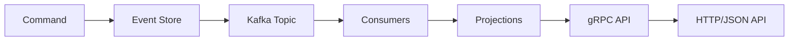

# Go Event Sourcing Example

A practical demonstration of **event sourcing** in Go, featuring a simplified order management system inspired by
platforms like eBay.

## 🎯 What This Project Demonstrates

This application showcases how to build a robust, event-sourced system that handles:

- ✅ **Order lifecycle management** (placement, payment, shipping)
- ✅ **Payment status tracking** with validation
- ✅ **Shipping status updates** with progression rules
- ✅ **Order cancellation** with proper state management

## 🏗 Architecture Overview

This project combines **event sourcing** with **CQRS (Command Query Responsibility Segregation)** to create a scalable,
reliable system.

### Core Components

| Component        | Purpose                                |
| ---------------- | -------------------------------------- |
| **Postgres**     | Event store + projection database      |
| **Kafka**        | Message bus for event notifications    |
| **gRPC**         | High-performance API layer             |
| **gRPC-Gateway** | HTTP/JSON wrapper for easy integration |

### Why This Architecture?

#### Event Sourcing Benefits

Instead of storing just the current state:

```json
{
  "order_id": 123,
  "payment_status": "PENDING",
  "shipping_status": "WAITING_FOR_PAYMENT"
}
```

We store the complete event history as our source of truth:

```json
[
  { "eventId": 1, "eventType": "OrderPlaced", "timestamp": "2024-01-01T10:00:00Z" },
  { "eventId": 2, "eventType": "OrderPaymentInitiated", "timestamp": "2024-01-01T10:05:00Z" },
  { "eventId": 3, "eventType": "OrderPaid", "timestamp": "2024-01-01T10:10:00Z" }
]
```

This approach provides:

- 🔒 **Reliability** - Every state change is recorded and recoverable
- 📋 **Transparency** - Complete audit trail for compliance
- 📈 **Scalability** - Events can be processed in parallel and replayed

#### Why Postgres + Kafka?

**Postgres as Event Store:**

- Fast, indexed queries for any aggregate
- Transactional guarantees for consistency
- Better for per-aggregate queries than Kafka

**Kafka as Message Bus:**

- High-throughput event streaming
- Reliable delivery to multiple consumers
- Perfect for triggering downstream processes

### Data Flow



1. **Commands** (e.g., `PlaceOrder`) write events to Postgres
2. **Same transaction** publishes notification to Kafka
3. **Consumers** read from Kafka and update projections
4. **Projections** are exposed via gRPC and HTTP APIs
5. **Future commands** validate against the event log

## 🚀 Quick Start

### Prerequisites

- Go 1.21+
- Docker & Docker Compose

### 1. Generate Code

```bash
# Generate protobuf stubs (runs in Docker)
./scripts/generate-buf.sh
```

### 2. Start Services

```bash
# Start dependencies (Postgres, Kafka)
make docker-up

# Start the application
make dev-api
```

The application will be available at:

- **gRPC**: `localhost:8081`
- **HTTP/JSON**: `localhost:8080`

## 📚 API Examples

### Place an Order

Create a new order and trigger the payment processing workflow:

```bash
curl -X POST http://localhost:8080/v1/orders \
  -H "Content-Type: application/json" \
  -d '{
    "customer_id": "big-name",
    "product_id": "big-product",
    "vendor_id": "big-vendor",
    "quantity": 5,
    "total_price": 99.99,
    "payment_method": "CREDIT_CARD"
  }'
```

**Response:**

```json
{
  "order_id": "018f1234-5678-9abc-def0-123456789abc"
}
```

### Get Order Details

Retrieve detailed information about a specific order:

```bash
curl -X GET http://localhost:8080/v1/orders/018f1234-5678-9abc-def0-123456789abc
```

**Response:**

```json
{
  "order": {
    "order_id": "018f1234-5678-9abc-def0-123456789abc",
    "customer_id": "big-name",
    "vendor_id": "big-vendor",
    "product_id": "big-product",
    "quantity": 5,
    "total_price": 99.99,
    "payment_method": "CREDIT_CARD",
    "payment_status": "PAYMENT_STATUS_PAID",
    "shipping_status": "SHIPPING_STATUS_WAITING_FOR_SHIPMENT",
    "created_at": "2024-01-01T10:00:00Z",
    "updated_at": "2024-01-01T10:10:00Z"
  }
}
```

**Note:** Returns `null` if the order doesn't exist.

### List Orders

Retrieve a paginated list of orders:

```bash
curl -X GET "http://localhost:8080/v1/orders?limit=10&offset=0"
```

**Response:**

```json
{
  "orders": [
    {
      "order_id": "018f1234-5678-9abc-def0-123456789abc",
      "payment_status": "PAYMENT_STATUS_PAID",
      "shipping_status": "SHIPPING_STATUS_WAITING_FOR_SHIPMENT",
      "created_at": "2024-01-01T10:00:00Z",
      "updated_at": "2024-01-01T10:10:00Z"
    },
    {
      "order_id": "018f1234-5678-9abc-def0-123456789def",
      "payment_status": "PAYMENT_STATUS_PENDING",
      "shipping_status": "SHIPPING_STATUS_WAITING_FOR_PAYMENT",
      "created_at": "2024-01-01T11:00:00Z",
      "updated_at": "2024-01-01T11:00:00Z"
    }
  ]
}
```

**Query Parameters:**

- `limit` (optional): Number of orders to return (1-100, default: 10)
- `offset` (optional): Number of orders to skip (default: 0)

### Cancel Order

Cancel an existing order with a reason:

```bash
curl -X PUT http://localhost:8080/v1/orders/018f1234-5678-9abc-def0-123456789abc/cancel \
  -H "Content-Type: application/json" \
  -d '{
    "reason": "Customer requested cancellation"
  }'
```

**Response:**

```json
{
  "order_id": "018f1234-5678-9abc-def0-123456789abc"
}
```

### Update Shipping Status

Update the shipping status of an order (requires order to be paid):

```bash
curl -X PUT http://localhost:8080/v1/orders/018f1234-5678-9abc-def0-123456789abc/shipping-status \
  -H "Content-Type: application/json" \
  -d '{
    "status": "SHIPPING_STATUS_IN_TRANSIT"
  }'
```

**Response:**

```json
{
  "order_id": "018f1234-5678-9abc-def0-123456789abc"
}
```

**Available Shipping Statuses:**

- `SHIPPING_STATUS_UNSPECIFIED`
- `SHIPPING_STATUS_WAITING_FOR_PAYMENT`
- `SHIPPING_STATUS_WAITING_FOR_SHIPMENT`
- `SHIPPING_STATUS_IN_TRANSIT`
- `SHIPPING_STATUS_DELIVERED`
- `SHIPPING_STATUS_CANCELLED`

**Available Payment Statuses:**

- `PAYMENT_STATUS_UNSPECIFIED`
- `PAYMENT_STATUS_PENDING`
- `PAYMENT_STATUS_INITIATED`
- `PAYMENT_STATUS_PAID`
- `PAYMENT_STATUS_FAILED`

## �� Technical Details

### Event Schema

We use **Protocol Buffers** for event definitions, providing:

**Benefits:**

- 🌍 **Language-agnostic** - Generate stubs for any language
- 🛡️ **Type safety** - Compile-time validation
- 🔄 **Schema evolution** - Backwards-compatible changes

**Trade-offs:**

- 📊 **Limited BI tooling** - Requires JSON conversion for analytics
- 👀 **Not human-readable** - Binary format needs parsing

### Project Structure

```
├── api/v1/           # Protobuf definitions
├── go/
│   ├── cmd/         # Application entrypoint
│   ├── internal/
│   │   ├── entity/  # Domain logic & projections
│   │   ├── infra/   # Infrastructure (store, bus, etc.)
│   │   └── service/ # gRPC service implementations
│   └── scripts/     # Build & deployment scripts
└── docker-compose.yml
```
