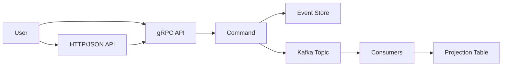
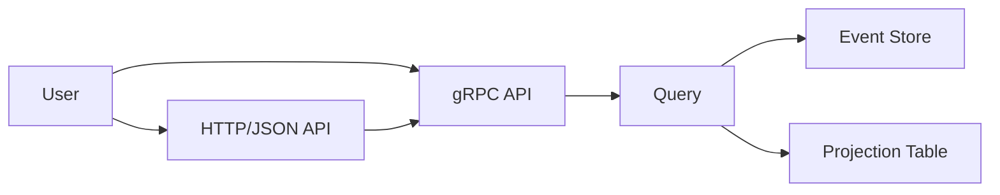

# Go Event Sourcing Example

A practical demonstration of **event sourcing** in Go, featuring a simplified order management system inspired by
platforms like eBay.

## 🎯 What This Project Demonstrates

This application showcases how to build a robust, event-sourced system that handles:

- ✅ **Order lifecycle management** (placement, payment, shipping)
- ✅ **Payment status tracking** with validation
- ✅ **Shipping status updates** with progression rules
- ✅ **Order cancellation** with proper state management

## 🏗 Architecture Overview

This project combines **event sourcing** with **CQRS (Command Query Responsibility Segregation)** to create a scalable,
reliable system.

### Core Components

| Component        | Purpose                                |
| ---------------- | -------------------------------------- |
| **Postgres**     | Event store + projection database      |
| **Kafka**        | Message bus for event notifications    |
| **gRPC**         | High-performance API layer             |
| **gRPC-Gateway** | HTTP/JSON wrapper for easy integration |

### Why This Architecture?

#### Event Sourcing Benefits

Instead of storing just the current state:

```json
{
  "order_id": 123,
  "payment_status": "PENDING",
  "shipping_status": "WAITING_FOR_PAYMENT"
}
```

We store the complete event history as our source of truth:

```json
[
  { "eventId": 1, "eventType": "OrderPlaced", "timestamp": "2024-01-01T10:00:00Z" },
  { "eventId": 2, "eventType": "OrderPaymentInitiated", "timestamp": "2024-01-01T10:05:00Z" },
  { "eventId": 3, "eventType": "OrderPaid", "timestamp": "2024-01-01T10:10:00Z" }
]
```

This approach provides:

- 🔒 **Reliability** - Every state change is recorded and recoverable
- 📋 **Transparency** - Complete audit trail for compliance
- 📈 **Scalability** - Events can be processed in parallel and replayed

For some systems, these characteristics might be nice-to-have. In others, they are a requirement.

#### Why Postgres + Kafka?

We use a combination of Postgres & Kafka due to the need to handle the following requirements:
- Safely and quickly append and retrieve events for a given aggregate ID.
- Publish events for asynchronous consumers.

Neither one of these tools can handle both these use cases on their own, so we use a combination.

#### CDC

This application publishes events to the message bus directly. This was done for simplicity sake, but it is not the only way to publish new events to consumers.

Instead of publishing to a bus directly, we could also capture changes to our event store with CDC tools (e.g. Debezium, DynamoDB streams). This would remove a potential point of failure in our application logic, but it would require extra infrastructure to maintain.

**Postgres as Event Store:**

- Fast, indexed queries for any aggregate
- Transactional guarantees for consistency
- Better for per-aggregate queries than Kafka

Alternatives:
- DynamoDB

**Kafka as Message Bus:**

- High-throughput event streaming
- Reliable delivery to multiple consumers
- Perfect for triggering downstream processes
- Can "replay" events by resetting a consumer's offset.

Alternatives:
- Kinesis
- SQS

### Data Flow

#### Commands



1. **Commands** (e.g., `PlaceOrder`) write new events to the event store and message bus.
2. **Consumers** read from Kafka and update projection table.

#### Queries


Queries can source data from two locations:

1. **Event Store**: fetch event log directly and create a projection in-request. This will always be up to date, but computationally intensive. (e.g. GetOrder)
2. **Projection Table**: fetch a projection created by an async consumer. Eventually consistent but much faster to query. (e.g. ListOrders)

## 🚀 Quick Start

### Prerequisites

- Go 1.21+
- Docker & Docker Compose

### 1. Generate Code

```bash
# Generate protobuf stubs (runs in Docker)
./scripts/generate-buf.sh
```

### 2. Start Services

```bash
# Start dependencies (Postgres, Kafka)
make docker-up

# Start the application
make dev-api
```

The application will be available at:

- **gRPC**: `localhost:8081`
- **HTTP/JSON**: `localhost:8080`

## 📚 API Examples

### Place an Order

Create a new order and trigger the payment processing workflow:

```bash
curl -X POST http://localhost:8080/v1/orders \
  -H "Content-Type: application/json" \
  -d '{
    "customer_id": "big-name",
    "product_id": "big-product",
    "vendor_id": "big-vendor",
    "quantity": 5,
    "total_price": 99.99,
    "payment_method": "CREDIT_CARD"
  }'
```

**Response:**

```json
{
  "order_id": "018f1234-5678-9abc-def0-123456789abc"
}
```

### Get Order Details

Retrieve detailed information about a specific order. Will generate a projection in-request.

```bash
curl -X GET http://localhost:8080/v1/orders/018f1234-5678-9abc-def0-123456789abc
```

**Response:**

```json
{
  "order": {
    "order_id": "018f1234-5678-9abc-def0-123456789abc",
    "customer_id": "big-name",
    "vendor_id": "big-vendor",
    "product_id": "big-product",
    "quantity": 5,
    "total_price": 99.99,
    "payment_method": "CREDIT_CARD",
    "payment_status": "PAYMENT_STATUS_PAID",
    "shipping_status": "SHIPPING_STATUS_WAITING_FOR_SHIPMENT",
    "created_at": "2024-01-01T10:00:00Z",
    "updated_at": "2024-01-01T10:10:00Z"
  }
}
```

**Note:** Returns NotFound error if the order doesn't exist.

### List Orders

Retrieve a paginated list of orders. Uses projection table.

```bash
curl -X GET "http://localhost:8080/v1/orders?limit=10&offset=0"
```

**Response:**

```json
{
  "orders": [
    {
      "order_id": "018f1234-5678-9abc-def0-123456789abc",
      "payment_status": "PAYMENT_STATUS_PAID",
      "shipping_status": "SHIPPING_STATUS_WAITING_FOR_SHIPMENT",
      "created_at": "2024-01-01T10:00:00Z",
      "updated_at": "2024-01-01T10:10:00Z"
    },
    {
      "order_id": "018f1234-5678-9abc-def0-123456789def",
      "payment_status": "PAYMENT_STATUS_PENDING",
      "shipping_status": "SHIPPING_STATUS_WAITING_FOR_PAYMENT",
      "created_at": "2024-01-01T11:00:00Z",
      "updated_at": "2024-01-01T11:00:00Z"
    }
  ]
}
```

**Query Parameters:**

- `limit` (optional): Number of orders to return (1-100, default: 10)
- `offset` (optional): Number of orders to skip (default: 0)

### Cancel Order

Cancel an existing order with a reason:

```bash
curl -X POST http://localhost:8080/v1/orders/018f1234-5678-9abc-def0-123456789abc/cancel \
  -H "Content-Type: application/json" \
  -d '{
    "reason": "Customer requested cancellation"
  }'
```

**Response:**

```json
{
  "order_id": "018f1234-5678-9abc-def0-123456789abc"
}
```

### Update Shipping Status

Update the shipping status of an order (requires order to be paid):

```bash
curl -X PUT http://localhost:8080/v1/orders/018f1234-5678-9abc-def0-123456789abc/shipping-status \
  -H "Content-Type: application/json" \
  -d '{
    "status": "SHIPPING_STATUS_IN_TRANSIT"
  }'
```

**Response:**

```json
{
  "order_id": "018f1234-5678-9abc-def0-123456789abc"
}
```

**Available Shipping Statuses:**

- `SHIPPING_STATUS_UNSPECIFIED`
- `SHIPPING_STATUS_WAITING_FOR_PAYMENT`
- `SHIPPING_STATUS_WAITING_FOR_SHIPMENT`
- `SHIPPING_STATUS_IN_TRANSIT`
- `SHIPPING_STATUS_DELIVERED`
- `SHIPPING_STATUS_CANCELLED`

## Technical Details

### Event Schema

We use **Protocol Buffers** for event definitions, providing:

**Benefits:**

- 🌍 **Language-agnostic** - Generate stubs for any language
- 🛡️ **Type safety** - Compile-time validation
- 🔄 **Schema evolution** - Backwards-compatible changes

**Trade-offs:**

- 📊 **Data Warehouse Compatability** - Requires JSON conversion for analytics
- 👀 **Not human-readable** - Binary format needs parsing

### Event Store Schema

The event store uses a **Postgres table** with the following structure:

```sql
CREATE TABLE event (
    event_id SERIAL PRIMARY KEY,
    sequence_number BIGINT NOT NULL,
    aggregate_id VARCHAR(255) NOT NULL,
    aggregate_type VARCHAR(255) NOT NULL,
    event_type VARCHAR(255) NOT NULL,
    event_data BYTEA NOT NULL,
    created_at TIMESTAMP WITH TIME ZONE NOT NULL DEFAULT NOW(),

    UNIQUE (sequence_number, aggregate_id)
);
```

**Key Fields:**

- **`event_id`**: Auto-incrementing unique identifier for each event
- **`sequence_number`**: Monotonic sequence number within an aggregate (starts at 0). Used for optimistic locking
- **`aggregate_id`**: Unique identifier for the business entity (e.g., order ID)
- **`aggregate_type`**: Type of aggregate (e.g., "order")
- **`event_type`**: Type of event (e.g., "order_placed", "order_paid")
- **`event_data`**: Binary protobuf data containing the event payload
- **`created_at`**: Timestamp when the event was stored

**Constraints & Indexes:**

- **Unique constraint** on `(sequence_number, aggregate_id)` ensures that we cannot create two events with the same sequence number. Used for optimistic locking
- **Index** on `aggregate_id` for fast aggregate event retrieval

**Optimistic Locking:**

The system uses optimistic locking via sequence numbers to prevent concurrent modification conflicts. Commands read the current sequence number, validate business rules, then attempt to write with `sequence_number + 1`. 

If another command has already written an event with that sequence number, the database constraint will prevent the duplicate from being inserted. The command will fail and can be retried safely. 

**Example Use Case:**

Two users try to pay for the same order simultaneously
   - User A reads events with sequence_number <= 2, attempts to write with sequence_number = 3
   - At the same time, User B reads events up sequence_number <= 2, attempts to write with sequence_number = 3
   - First write succeeds, second fails with constraint violation
   - Only one payment event is recorded, preventing double-charging

### Project Structure

```
├── api/v1/           # Protobuf definitions
├── go/
│   ├── cmd/          # Application entrypoint
│   ├── internal/
│   │   ├── entity/   # Domain logic & projections
│   │   ├── infra/    # Infrastructure (store, bus, etc.)
│   │   └── service/  # gRPC service implementations
│   └── scripts/      # Build & deployment scripts
├── resources/
│   ├── docker/       # Dockerfiles
│   └── migrations/   # Database migrations
└── docker-compose.yml
```
